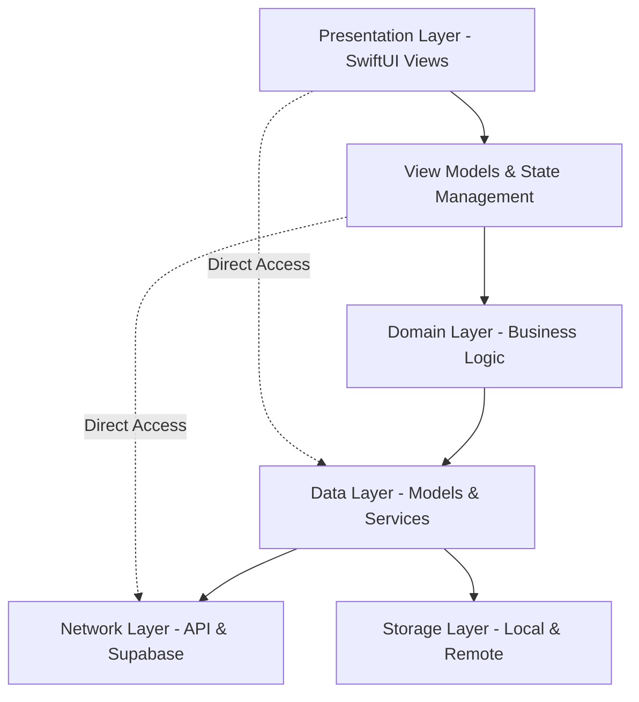
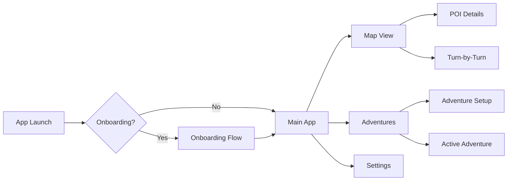
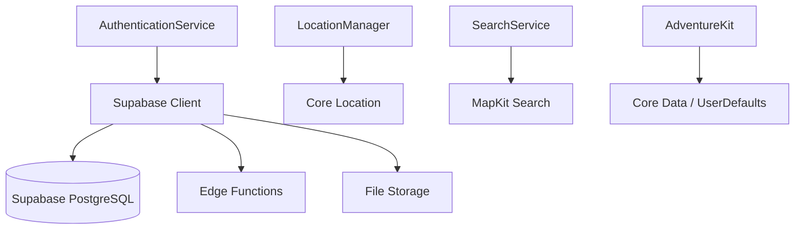
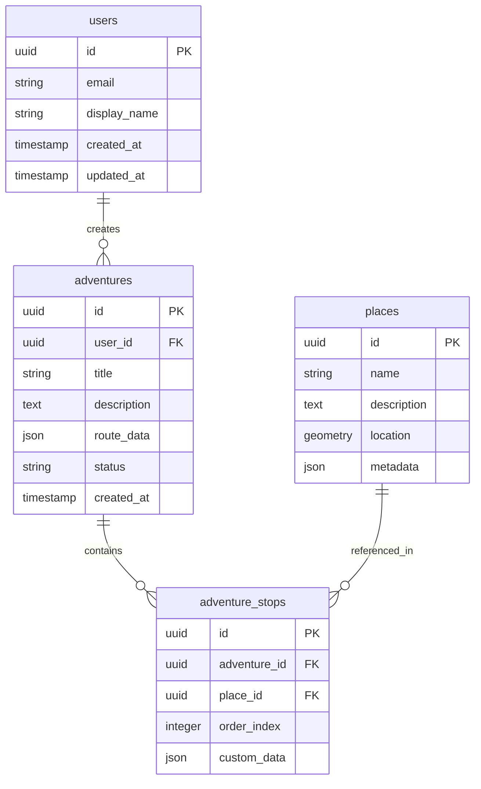
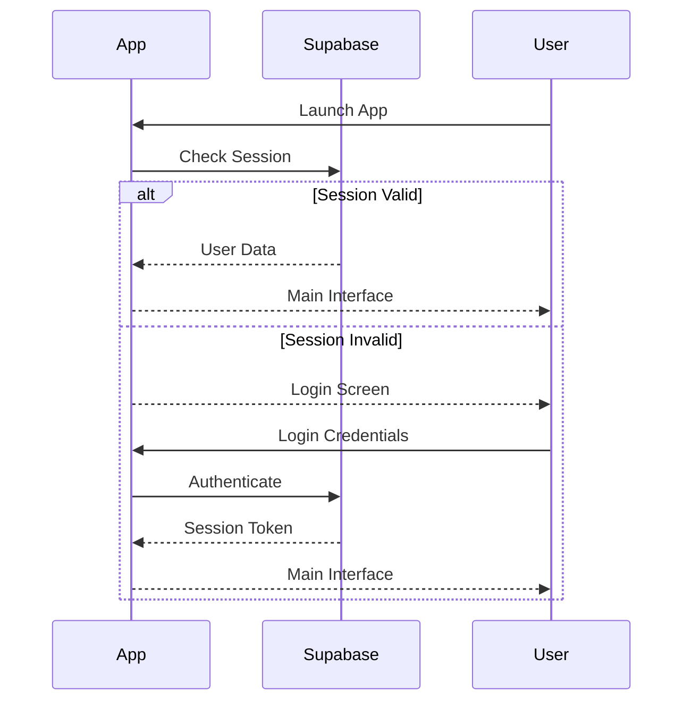
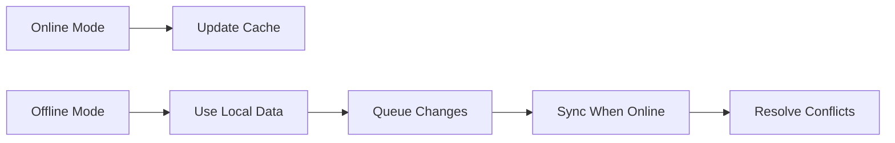
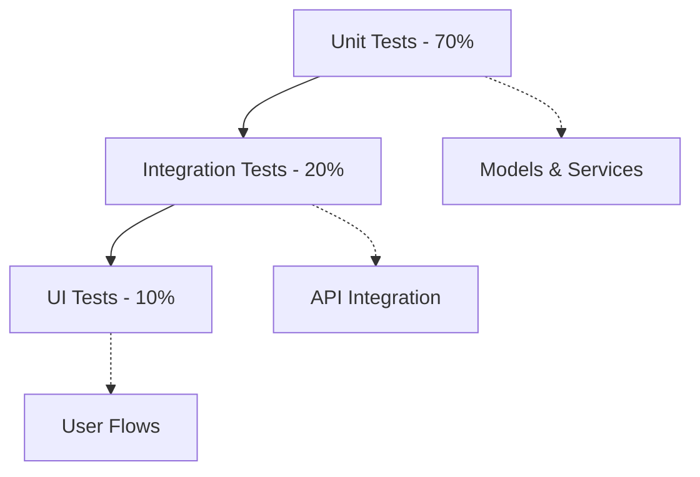
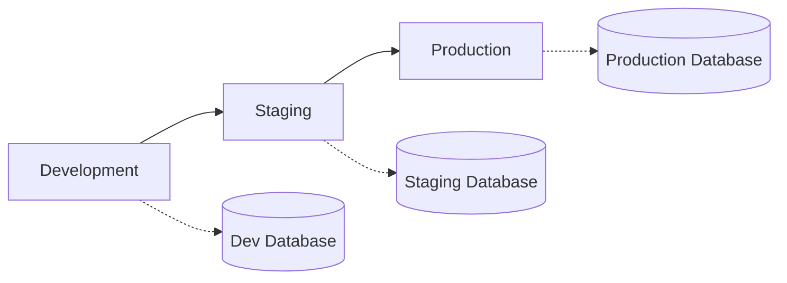

# Shvil App - Architecture Documentation

## System Overview

Shvil is an Apple-grade navigation and adventure app for Israel, built with Swift and SwiftUI, using Supabase as the backend service. The architecture follows Apple's recommended patterns with a focus on performance, accessibility, and user experience.

## Architecture Layers



## Presentation Layer (SwiftUI)

### Core Views
- **ContentView.swift**: Main app container with tab navigation
- **MapView.swift**: Primary map interface with POI and navigation
- **AdventuresView**: Adventure planning and management
- **SettingsView**: User preferences and configuration
- **OnboardingView**: First-time user experience

### Navigation Flow



## State Management Strategy

### ObservableObject Pattern
- **AppState**: Global application state
- **ThemeManager**: Design system and appearance
- **LocalizationManager**: Multi-language support
- **PerformanceOptimizer**: Performance monitoring

### Dependency Injection
```swift
class DependencyContainer {
    static let shared = DependencyContainer()
    
    // Core Services
    let appState: AppState
    let authenticationService: AuthenticationService
    let navigationService: NavigationService
    let searchService: SearchService
    let locationManager: LocationManager
    
    // Business Logic
    let adventureKit: AdventureKit
    let mapService: MapService
}
```

## Data Layer Architecture

### Models
- **User**: Authentication and profile data
- **AdventurePlan**: Adventure configurations and routes
- **SearchResult**: Location and POI data
- **MapAnnotation**: Map marker information

### Services Architecture



## Supabase Integration

### Database Schema


### Authentication Flow


### Data Synchronization
- **Online**: Real-time sync with Supabase
- **Offline**: Local storage with sync queue
- **Conflict Resolution**: Last-write-wins with timestamp comparison

## Feature Flag System

### Current Flags
```swift
enum Feature: String, CaseIterable {
    case liquidGlassNavV1 = "liquid_glass_nav_v1"
    case advancedRouting = "advanced_routing"
    case voiceGuide = "voice_guide"
    case socialSharing = "social_sharing" // DISABLED for MVP
    case huntMode = "hunt_mode" // DISABLED for MVP
}
```

### Flag Configuration
- **Development**: All experimental features enabled
- **Staging**: Selected beta features
- **Production**: Stable features only

## Error Handling Strategy

### Error Types
```swift
enum AppError: Error, Identifiable {
    case networkError(NetworkError)
    case authenticationError(AuthError)
    case locationError(LocationError)
    case dataCorruption(DataError)
    
    var id: String { "\(self)" }
    var userMessage: String { /* Localized messages */ }
    var recoveryAction: (() -> Void)? { /* Recovery logic */ }
}
```

### Error Boundaries
1. **View Level**: Local error states with retry actions
2. **Service Level**: Automatic retry with exponential backoff
3. **App Level**: Global error handler with crash reporting

## Performance Architecture

### Optimization Strategies
- **View Rendering**: DrawingGroup for complex views
- **Image Loading**: Lazy loading with placeholder states  
- **List Performance**: RecyclerView pattern for large datasets
- **Memory Management**: Weak references and proper cleanup

### Performance Monitoring
```swift
@MainActor
class PerformanceOptimizer: ObservableObject {
    @Published var frameRate: Double = 60.0
    @Published var memoryUsage: UInt64 = 0
    @Published var networkLatency: TimeInterval = 0
}
```

## Offline Support

### Cached Data
- **Map Tiles**: Essential map data for offline navigation  
- **User Adventures**: Local storage for offline access
- **POI Data**: Cached search results and place information
- **User Preferences**: Local settings and configuration

### Sync Strategy


## Security Architecture

### Data Protection
- **Local Storage**: Keychain for sensitive data
- **Network**: TLS 1.3 for all communications
- **Authentication**: JWT tokens with refresh mechanism
- **Privacy**: Location data anonymization

### Privacy Compliance
- **Location**: Precise location only when navigating
- **Analytics**: Opt-in telemetry with user consent
- **Data Retention**: Automatic cleanup of old data

## Testing Strategy

### Test Pyramid


### Test Coverage Goals
- **View Models**: 90% code coverage
- **Business Logic**: 95% code coverage  
- **API Integration**: 80% code coverage
- **Critical User Flows**: 100% path coverage

## Deployment Architecture

### Build Configuration


### Environment Variables
```swift
enum Environment {
    case development
    case staging  
    case production
    
    var supabaseURL: String { /* Environment URLs */ }
    var supabaseKey: String { /* Environment Keys */ }
    var analyticsEnabled: Bool { /* Analytics settings */ }
}
```

## Localization Architecture

### Supported Languages
- **English** (en): Primary language
- **Hebrew** (he): RTL support with mirrored layouts
- **French** (fr): Secondary European language

### RTL Support Strategy
```swift
extension View {
    func supportRTL() -> some View {
        environment(\.layoutDirection, LocalizationManager.shared.isRTL ? .rightToLeft : .leftToRight)
            .flipsForRightToLeftLayoutDirection(true)
    }
}
```

## Accessibility Architecture

### WCAG 2.1 Compliance
- **Level AA**: Minimum compliance target
- **Dynamic Type**: Full support for text scaling
- **VoiceOver**: Complete screen reader support
- **Reduce Motion**: Respect accessibility preferences

### Implementation Pattern
```swift
extension View {
    func makeAccessible(
        label: String,
        hint: String? = nil,
        traits: AccessibilityTraits = []
    ) -> some View {
        accessibilityLabel(label)
            .accessibilityHint(hint ?? "")
            .accessibilityAddTraits(traits)
            .frame(minWidth: 44, minHeight: 44) // Minimum touch target
    }
}
```

## Monitoring and Analytics

### Performance Metrics
- Frame rate and rendering performance
- Memory usage and leak detection
- Network request latency and success rates
- Crash reporting and error tracking

### User Analytics  
- Screen view tracking
- Feature usage metrics
- User journey analysis
- A/B testing infrastructure

## Future Architecture Considerations

### Scalability Plans
- Modular architecture for feature splitting
- Microservice backend migration path
- Multi-platform support (iPadOS, macOS, watchOS)

### Technology Evolution
- SwiftUI performance improvements
- iOS 18+ feature adoption
- Apple Intelligence integration opportunities
- Enhanced privacy features