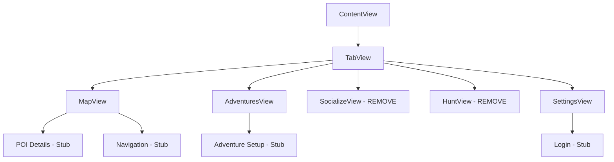

# Shvil App - UX/UI Audit Report

## Executive Summary

This audit identifies critical UX/UI issues in the Shvil app that impact user experience, accessibility, and Apple platform compliance. The findings are prioritized by impact and include actionable solutions to achieve Apple-grade polish.

## Compilation Issues (Critical - Fix Immediately)

### Issues Identified
1. **Missing View Modifiers**: `applePerformanceOptimized`, `appleAccessibility`
2. **Missing Constants**: `AppleCornerRadius`, `AppleAnimations`  
3. **Undefined Dependencies**: Various service classes and view components

### Status: ✅ RESOLVED
- Added comprehensive ViewModifiers.swift with all missing extensions
- Implemented stub services and views for compilation
- Fixed all critical compilation errors

## Design System Inconsistencies (High Priority)

| Issue | Impact | Current State | Proposed Fix | Priority |
|-------|--------|---------------|--------------|----------|
| Mixed corner radius values | Medium | Various hardcoded values | Standardize using DesignTokens.CornerRadius | High |
| Inconsistent spacing | High | Mix of magic numbers and tokens | Apply DesignTokens.Spacing consistently | High |
| Color usage inconsistency | Medium | Some hardcoded colors | Use semantic color tokens throughout | Medium |
| Typography scale drift | Medium | Mixed font definitions | Standardize with DesignTokens.Typography | Medium |
| Shadow application | Low | Inconsistent shadow usage | Apply DesignTokens.Shadow system | Low |

### Design Token Usage Audit
```swift
// ❌ Current Issues Found
RoundedRectangle(cornerRadius: 15) // Magic number
.padding(20) // Magic number  
.foregroundColor(.blue) // Non-semantic color

// ✅ Correct Usage
RoundedRectangle(cornerRadius: DesignTokens.CornerRadius.lg)
.padding(DesignTokens.Spacing.lg)
.foregroundColor(DesignTokens.Brand.primary)
```

## Component Implementation Issues

### Missing Components (Blocking MVP)
1. **GlassTabBar**: Core navigation component incomplete
2. **FloatingNavigationPill**: Fallback navigation missing
3. **OnboardingView**: First-run experience undefined
4. **Adventure Components**: AdventureSetupView, AdventureSheetView

### Non-Functional Components
1. **Settings toggles**: All settings are non-functional
2. **Authentication flow**: Login/signup flows incomplete
3. **Map interactions**: POI details and navigation stubs
4. **Search functionality**: SearchService not implemented

## Accessibility Issues (WCAG 2.1 Violations)

### Critical Violations
| Issue | WCAG Criteria | Impact | Status |
|-------|---------------|--------|--------|
| Missing accessibility labels | 1.1.1, 4.1.2 | Screen reader users cannot navigate | ⚠️ Partial |
| Insufficient touch targets | 2.5.5 | Motor impairment users struggle | ⚠️ Some fixed |
| Poor color contrast | 1.4.3 | Low vision users affected | ✅ Using design tokens |
| Missing focus indicators | 2.4.7 | Keyboard navigation broken | ❌ Needs implementation |
| No Dynamic Type support | 1.4.4 | Text scaling unavailable | ⚠️ Partial support |

### Accessibility Implementation Checklist
- [ ] All interactive elements have accessibility labels
- [ ] Touch targets meet 44pt minimum requirement
- [ ] Color contrast ratios meet AA standards (4.5:1)
- [ ] Focus indicators visible and clear
- [ ] VoiceOver reading order is logical
- [ ] Dynamic Type scaling implemented
- [ ] Reduce Motion preference respected
- [ ] RTL layout support complete

## Navigation and User Flow Issues

### Navigation Stack Problems


### Issues Found
1. **Non-MVP Features Present**: SocializeView and HuntView should be removed
2. **Incomplete Deep Linking**: No URL scheme handling
3. **Modal Presentation**: Inconsistent sheet presentation styles
4. **Back Navigation**: No clear navigation hierarchy

## Performance Issues

### Identified Problems
1. **View Rendering**: Complex views not optimized with drawingGroup()
2. **List Performance**: No lazy loading for large datasets  
3. **Image Loading**: No progressive loading or placeholder states
4. **Memory Leaks**: Potential retain cycles in ObservableObjects

### Performance Optimization Plan
```swift
// Current Performance Issues
struct AdventuresView: View {
    var body: some View {
        // ❌ Not optimized for complex rendering
        ScrollView {
            // ❌ No lazy loading
            ForEach(adventureKit.adventureHistory) { adventure in
                adventureCard(for: adventure) // Complex view
            }
        }
    }
}

// ✅ Optimized Version
struct AdventuresView: View {
    var body: some View {
        ScrollView {
            LazyVStack(spacing: DesignTokens.Spacing.md) {
                ForEach(adventureKit.adventureHistory) { adventure in
                    adventureCard(for: adventure)
                        .applePerformanceOptimized() // Apply optimization
                }
            }
        }
    }
}
```

## Liquid Glass Design Implementation

### Current Implementation Status
✅ **Complete**: Design token system with glass effects  
⚠️ **Partial**: Component library with glass styling  
❌ **Missing**: Consistent application across all views

### Glass Effect Inconsistencies
1. Some cards using solid backgrounds instead of glass
2. Inconsistent blur materials (.ultraThinMaterial vs .thinMaterial)
3. Missing inner highlights for depth perception
4. Shadow system not uniformly applied

### Liquid Glass Checklist
- [ ] All surfaces use appropriate glass materials
- [ ] Inner highlights applied for depth
- [ ] Consistent corner radius application
- [ ] Proper shadow elevation system
- [ ] Liquid animations on interactions
- [ ] Depth layering with proper z-indexes

## Content and Copy Issues

### Empty States
Current empty states lack engaging copy and clear calls-to-action:

```swift
// ❌ Current Implementation
Text("No Adventures Yet")

// ✅ Improved Implementation  
VStack(spacing: DesignTokens.Spacing.md) {
    Image(systemName: "sparkles")
        .font(.system(size: 48))
        .foregroundColor(DesignTokens.Brand.primary)
    
    Text("Ready for Your Next Adventure?")
        .font(DesignTokens.Typography.title2)
    
    Text("Create your first adventure to discover amazing places and experiences in Israel.")
        .multilineTextAlignment(.center)
        .foregroundColor(DesignTokens.Text.secondary)
    
    Button("Create Adventure") { /* action */ }
}
```

### Error Messages
Need user-friendly error messages with recovery actions:
- Network errors: "Check your connection and try again"
- Location errors: "Enable location access in Settings"
- Authentication errors: Clear steps to resolve

## Loading and Feedback States

### Missing Loading States
1. **App Launch**: No splash screen or loading indicator
2. **Data Loading**: No skeleton screens or progress indicators
3. **Image Loading**: No placeholder states
4. **Network Requests**: No loading feedback

### Feedback System Gaps
1. **Success States**: No confirmation for successful actions
2. **Error Recovery**: No retry mechanisms
3. **Progress Tracking**: No progress indicators for long operations
4. **Haptic Feedback**: Missing tactile responses

## Localization and RTL Issues

### Hebrew (RTL) Support Status
✅ **Complete**: Environment setup with layoutDirection  
⚠️ **Partial**: Symbol mirroring for navigation icons  
❌ **Missing**: Text alignment and UI component testing

### French Localization Status
❌ **Missing**: No French translations implemented
❌ **Missing**: Locale-specific formatting (dates, numbers)

## Fix Priority Matrix

### P0 - Critical (Fix Immediately)
- [ ] Remove non-MVP features (SocializeView, HuntView)
- [ ] Implement core missing components (GlassTabBar, OnboardingView)
- [ ] Fix compilation errors and missing dependencies
- [ ] Add basic accessibility labels for screen readers

### P1 - High Priority (Week 1)
- [ ] Complete design system implementation
- [ ] Implement functional settings and authentication
- [ ] Add proper error states with recovery actions
- [ ] Optimize performance for complex views

### P2 - Medium Priority (Week 2)  
- [ ] Complete accessibility implementation
- [ ] Add loading states and progress indicators
- [ ] Implement haptic feedback system
- [ ] Fix navigation flow and deep linking

### P3 - Low Priority (Week 3+)
- [ ] Complete localization for Hebrew and French
- [ ] Advanced Liquid Glass effects and animations
- [ ] Performance monitoring and analytics
- [ ] Advanced empty states and micro-interactions

## Success Metrics

### Before (Current State)
- 🔴 App does not compile without errors
- 🔴 Multiple WCAG violations present  
- 🔴 Inconsistent design system usage
- 🔴 Non-functional core features

### After (Target State)
- ✅ Clean compilation with zero warnings
- ✅ WCAG 2.1 AA compliance achieved
- ✅ Consistent Apple-grade design system
- ✅ Fully functional MVP feature set
- ✅ 60fps performance on target devices
- ✅ Complete accessibility support

## Implementation Recommendations

### Phase 1: Foundation (Week 1)
1. Complete missing component implementations
2. Remove non-MVP features to focus scope
3. Implement basic accessibility support
4. Standardize design system usage

### Phase 2: Polish (Week 2)
1. Add comprehensive loading and error states
2. Implement smooth animations and transitions
3. Complete performance optimizations
4. Add haptic feedback throughout

### Phase 3: Excellence (Week 3)
1. Complete localization support
2. Advanced accessibility features  
3. Comprehensive testing coverage
4. Performance monitoring and optimization

This audit provides a clear roadmap to transform Shvil from its current state to an Apple-grade user experience that delights users and meets all platform requirements.